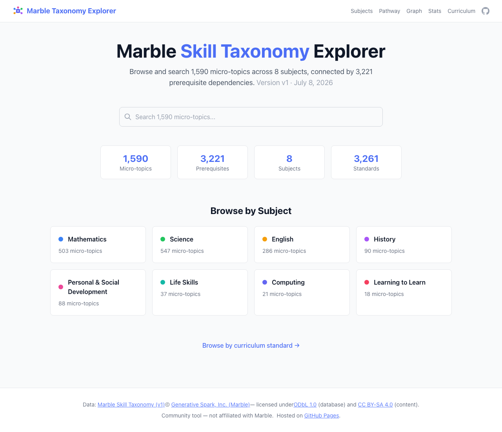
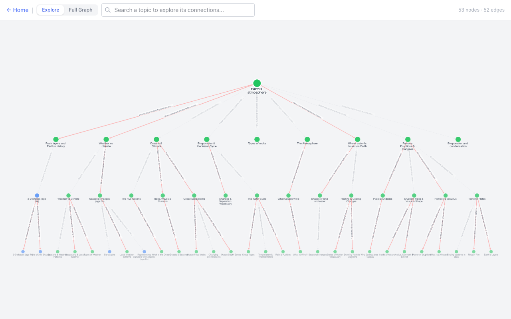
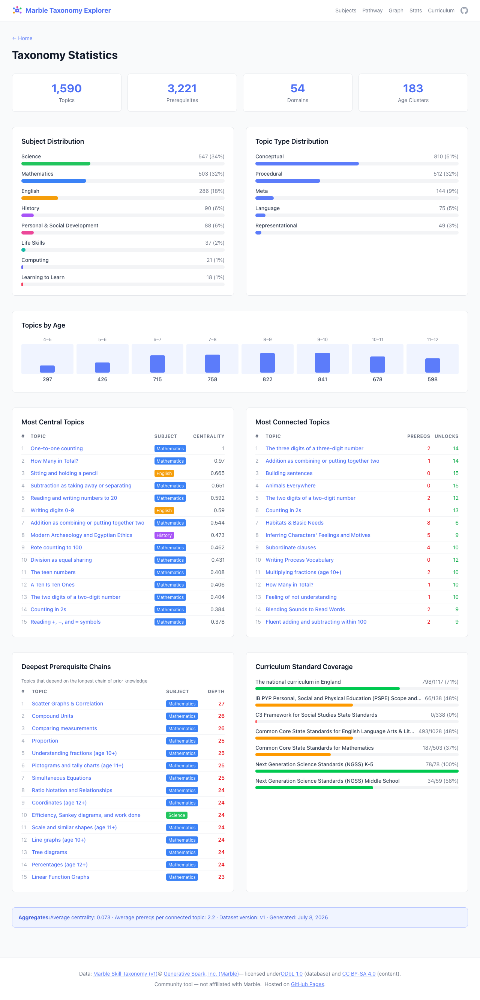
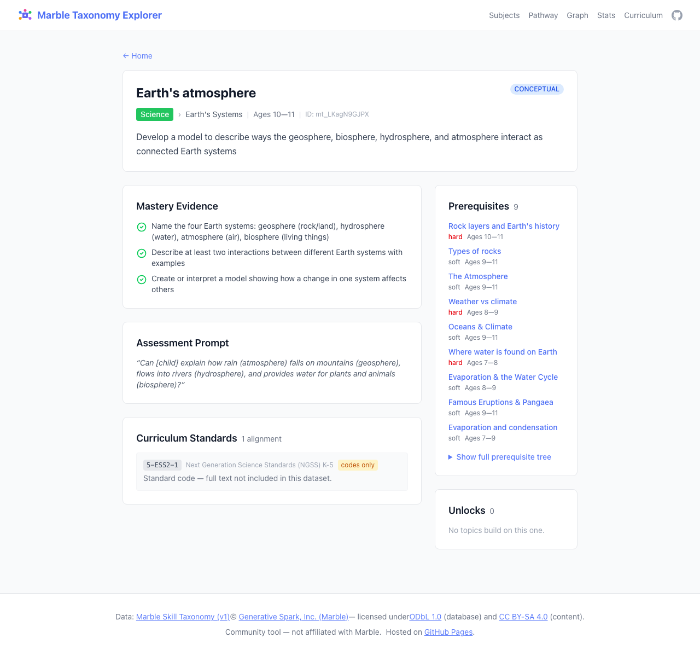
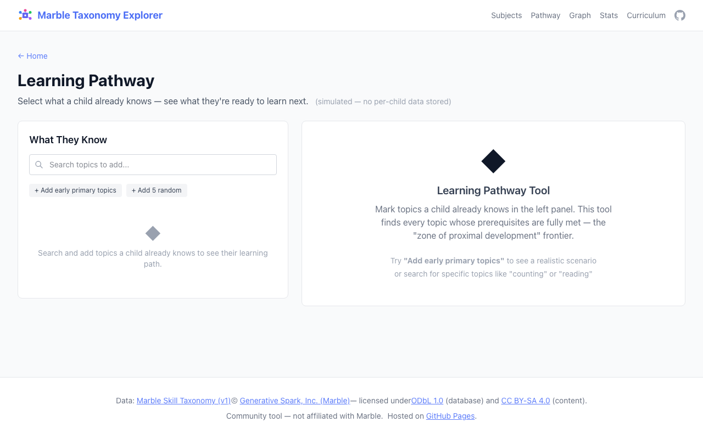

# Marble Taxonomy Explorer

[](https://github.com/ashutoshsinghpr7/marble-taxonomy-explorer/actions/workflows/deploy.yml)
[](https://github.com/ashutoshsinghpr7/marble-taxonomy-explorer/blob/main/package.json)
[](https://github.com/ashutoshsinghpr7/marble-taxonomy-explorer/tree/main/src/data/taxonomy)
[](https://ashutoshsinghpr7.github.io/marble-taxonomy-explorer/)
[](https://ashutoshsinghpr7.github.io/marble-taxonomy-explorer/)

A static site that renders the [Marble Skill Taxonomy](https://github.com/withmarbleapp/os-taxonomy) — 1,590 micro-topics across 8 subjects, connected by 3,221 prerequisite dependencies.

Built with **Astro + Svelte + Tailwind CSS**.

**Live:** [https://ashutoshsinghpr7.github.io/marble-taxonomy-explorer/](https://ashutoshsinghpr7.github.io/marble-taxonomy-explorer/) (hosted on **GitHub Pages**)

## Screenshots



| [Graph Explorer](https://ashutoshsinghpr7.github.io/marble-taxonomy-explorer/graph) | [Statistics](https://ashutoshsinghpr7.github.io/marble-taxonomy-explorer/stats) |
|---|---|
|  |  |

| [Topic Detail](https://ashutoshsinghpr7.github.io/marble-taxonomy-explorer/topics/mt_Bf91Aoi1Hn) | [Learning Pathway](https://ashutoshsinghpr7.github.io/marble-taxonomy-explorer/pathway) |
|---|---|
|  |  |

[Live demo →](https://ashutoshsinghpr7.github.io/marble-taxonomy-explorer/)

## Features

- **Browse** — subject pages with domain grouping and topic detail pages with collapsible prerequisite trees
- **Search** — full-text search across all 1,590 topics with instant results
- **Graph Explorer** — interactive Cytoscape.js visualization with two modes:
  - *Explore* — search a topic to see its prerequisite chain up to 3 levels deep, with edge labels showing *why* each dependency exists
  - *Full Graph* — filter by subject, trace prerequisites, find shortest paths between topics
- **Statistics** — distribution charts, centrality rankings, deepest prerequisite chains, curriculum coverage
- **Learning Pathway** — mark known topics to see what's ready to learn next
- **Curriculum** — searchable standards reference with age/grade filtering

## Quick Start

```bash
npm install
npm run dev
```

Open `http://localhost:4321`.

## Build

```bash
npm run build
```

Output goes to `dist/`. Built site is ~1,600 static pages — no server required.

## Deploy to GitHub Pages

The [deploy workflow](.github/workflows/deploy.yml) runs on every push to `main` and builds + deploys via `withastro/action@v2`. No manual setup needed — just push.

To set up from scratch:

1. Go to **Settings → Pages**
2. Set **Source** to "GitHub Actions"

## Data

Taxonomy data is sourced from [withmarbleapp/os-taxonomy](https://github.com/withmarbleapp/os-taxonomy) and stored in `src/data/taxonomy/data/`.

### Automatic updates

A [sync workflow](.github/workflows/sync-upstream.yml) runs **weekly** (Sundays) and checks the upstream repo for changes. When new data is detected, it:
1. Downloads updated JSON files, schemas, and metadata
2. Runs a full build to verify nothing breaks
3. Opens a PR with the changes

After reviewing and merging the PR, the deploy workflow pushes the updated site to GitHub Pages.

You can also trigger a sync manually from the **Actions** tab → "Sync Upstream Taxonomy" → "Run workflow".

### Manual update

```bash
rm -rf src/data/taxonomy-temp
git clone --depth=1 https://github.com/withmarbleapp/os-taxonomy.git src/data/taxonomy-temp
cp src/data/taxonomy-temp/data/*.json src/data/taxonomy/data/
cp src/data/taxonomy-temp/schema/*.json src/data/taxonomy/schema/
cp src/data/taxonomy-temp/{PROVENANCE,CHANGELOG,README}.md src/data/taxonomy/
cp src/data/taxonomy-temp/{LICENSE,LICENSE-CONTENT,CITATION.cff} src/data/taxonomy/
rm -rf src/data/taxonomy-temp
npm run build   # verify nothing broke
```

## License

### Site code
MIT

### Taxonomy data
- **Database** (structure, IDs, relationships): [ODbL 1.0](src/data/taxonomy/LICENSE)
- **Content** (descriptions, evidence, assessment prompts, dependency reasons): [CC BY-SA 4.0](src/data/taxonomy/LICENSE-CONTENT)
- **Copyright**: &copy; Generative Spark, Inc. (Marble) · https://withmarble.com

Attribution: any use must credit the [Marble Skill Taxonomy (v1)](https://github.com/withmarbleapp/os-taxonomy). See [CITATION.cff](src/data/taxonomy/CITATION.cff) for formal citation details.

For curriculum standard licensing notices, see [PROVENANCE.md](src/data/taxonomy/PROVENANCE.md).

### Disclaimer
Community tool — not affiliated with [Marble](https://withmarble.com).
